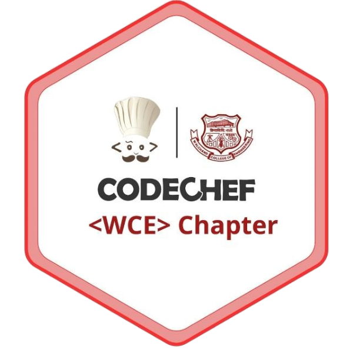

<div align="center">
    
    <br />
    <br />
    <p>
			<sup>
				<a href="https://discord.gg/HNhdsnbTb5">
                    
                </a>
			</sup>
    </p>
</div>

<br />

# Contest Parser
[](https://github.com/suyash-chavan/Contest-Parser/issues)
[](CONTRIBUTING.md)
[](https://opensource.org/licenses/MIT)

## About
* Contest Parser is a tool that can be used for Codeforces and Codechef Live contests, to quickly generate input, outupt files for sample test cases available over the problem page as well as manual test cases. It also generates corresponding code file for each problem according to the template.
* It comes with a Judge which checks the program output and expected output. The Judge is also useful if problem involves Multiple Correct outputs. In this case user needs to specify the way Judge should judge the program output and expected output. 

## Getting Started

These instructions will get you a copy of the project up and running on your local machine for development and testing purposes. See deployment for notes on how to deploy the project on a live system.

### Prerequisites
* Python 3.6 or above

### Installing

1. Download latest version of Contest Parser avaliable in Releases section.
2. Extract the zip file and install it with following commands.

```
chmod +x install.sh
sudo ./install.sh
```

## Contributing

Please read [CONTRIBUTING.md](CONTRIBUTING.md) for details on our code of conduct, and the process for submitting pull requests to us.

## License

This project is licensed under the MIT License - see the [LICENSE.md](LICENSE.md) file for details
